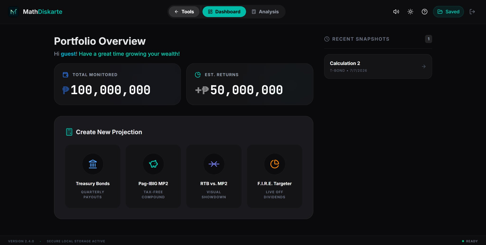
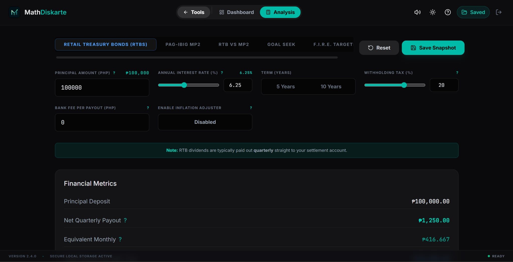
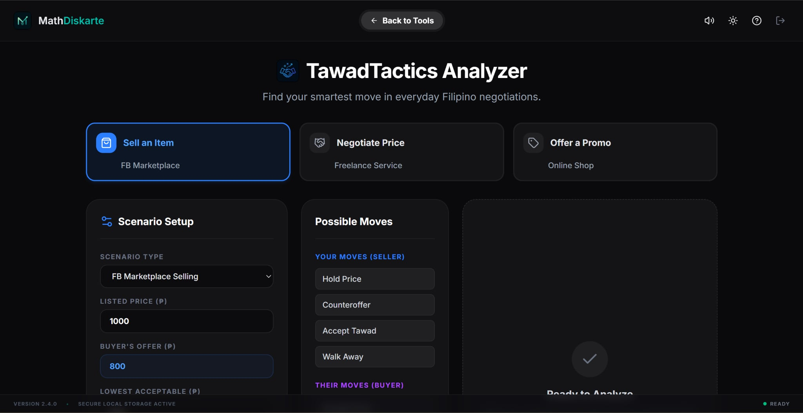
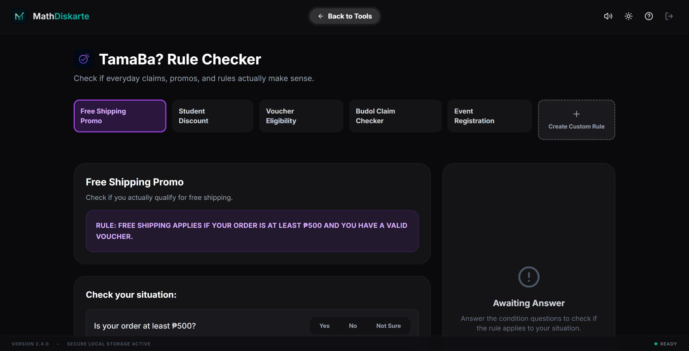

# MathDiskarte

MathDiskarte is a comprehensive Filipino everyday math toolkit designed to help users make smarter decisions regarding personal finance, negotiation, and logical reasoning.

## Overview

The application features three main tools, each addressing common scenarios using mathematical and logical frameworks:

1. **IponTubo**
   A Philippine finance calculator focused on investment growth projections. It features analysis tools for Pag-IBIG MP2 and Retail Treasury Bonds (RTB), allowing users to calculate yields, adjust for inflation, and set target financial goals.
2. **TawadTactics**
   A Game Theory-based analyzer designed for Filipino bargaining and pricing scenarios. It utilizes the Maximin strategy and Nash Equilibrium to help you identify the smartest negotiation moves when buying or selling.
3. **TamaBa?**
   A propositional logic checker that evaluates everyday claims, promotional rules, and eligibility conditions. It systematically verifies if a stated rule holds true based on provided conditions.

## Previews

### Dashboard


### IponTubo Dashboard


### IponTubo Analysis


### TawadTactics


### TamaBa?


## Technology Stack

- **React & TypeScript:** For robust, type-safe UI components.
- **Tailwind CSS:** For clean, responsive, and maintainable styling.
- **Vite:** As the frontend build tool ensuring fast development and optimized production builds.

## Getting Started

1. Clone the repository.
2. Install dependencies:
   ```bash
   npm install
   ```
3. Run the development server:
   ```bash
   npm run dev
   ```
4. Build for production:
   ```bash
   npm run build
   ```

## License

This project is licensed under the MIT License.
